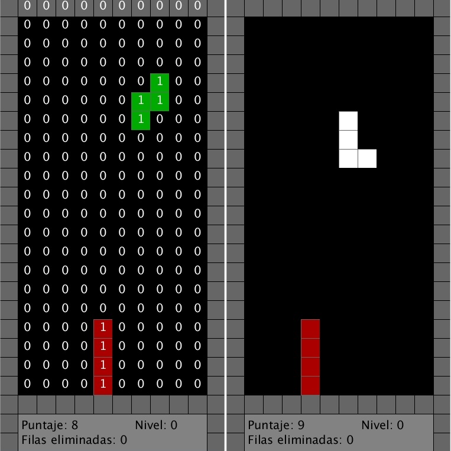
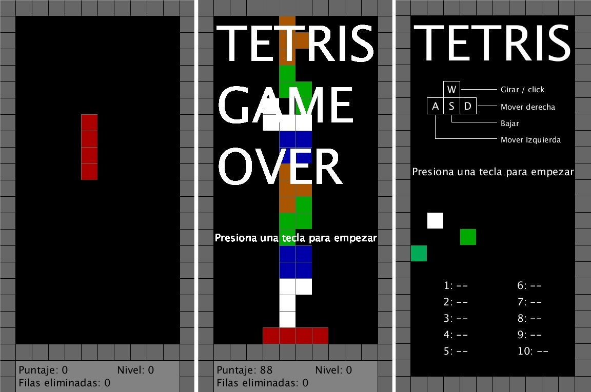

# Tetris programación estructurada
---
**Tabla de contenido**

- Objetivo
- Descripción
- Seleccion de estrategias
    + Tablero de juego
    + Estrategia de visualización
    + Rotaciones
    + Desplazamiento
    + Analisis de filas
    + Puntuacion
- Estrategia de jugabilidad y puntaje
    + Puntaje
    + Nivel
- Instrucciones de juego
- Posibles mejoras
- Conclusiones

## Objetivos 
Para un correcto dominio de la programacion orientada a objetos es fundamental comprender el paradigma de la programacion estructurada, bajo esta premisa el objetivo de este ejercicio es repasar los conceptos basicos de la programacion estructurada.
## Descripción
Como ejercicio de programación de la clase de POO se planteó desarrollar el clasico ruso de los videojuegos [Tetris](https://es.wikipedia.org/wiki/Tetris), utilizando como paradigma de desarrollo la programacion estructurada. Para esta tarea se utilizó [Processing](https://processing.org), lenguaje de programacion y entorno de desarrollo integrado basado en Java. Como objetivo principal del desarrolló, se buscó reducir al maximo los posibles metodos y clases en el codigo, siendo el unico objeto utilizado una estructura de datos llamada **Array** y el metodo **lenght**. La información referente a jugabilidad y puntuacion se extrajo del [articulo de Tetris en Wikipedia](https://en.wikipedia.org/wiki/Tetris), adicionalmente se buscó imitar la jugabilidad de algunas versiones publicas encontradas en internet.
## Selección de estrategias
### Tablero de juego
El tablero de juego es una **Array** de 3 dimensiones, el cual podemos representar como una matriz de 22 filas y 10 columnas, cada elemento de esta matriz consta de 4 datos.

```processing
int[][][] tablero[fila][columna][dato] 
```

El uso de cada dato se especifica a continuacion:

|Dato [0]| Dato [1] |Dato[2] |Dato[3]|
|--------|----------|--------|-------|
|Estado de la casilla|Componente color R de la casilla|Componente color G de la casilla|Componente color B de la casilla|

De esta forma se tiene control total sobre la casilla y su color en todo momento del juego.

### Estrategia de visualización

La visualizacion del tablero de juego es una constante visualizacion de la matriz ```tablero[][][]``` , esta visualizacion se realiza mediante la funcion sin retorno ```dibujar_tablero(); ```, todo cambio sufrido por la matriz del tablero se verá reflejado inmediatamente en la interfaz que ve el jugador. 



En la imagen de la izquierda se está mostrando el valor de ```
tablero[fila][columna][0]  ```
 
Para agregar un tetromino al tablero se utiliza la funcion ``` dibujar_pieza(int tetromino,int  estado,int columna,int fila, boolean enable)  ```, cuando el ```enable``` está en ``` false ``` se borrará esa pieza en esa ubicación, cuando está en ``` true ``` se dibujará la pieza en esa ubicación, el parametro estado indica la rotación del tetrominó.

### Rotaciones

Para realizar las rotaciones se utiliza la función ``` girar_pieza(int pieza, int estado_pieza, int columna, int fila) ```, la cual comprobará en la matriz ``` tablero[][][] ``` si la posicion donde rotará la pieza está libre de interferencias y si está dentro de los limites del tablero, borrará la pieza actual y la dibujara en la nueva posicion y nueva rotación.

```processing
//Breve segmento de la funcion girar_pieza();
if (columna>=2 && columna<=8) {  //Comprueba limites del tablero
        if (tablero[fila+1][columna-2][0]==0   //Comprueba que no existan interferencias
          &&tablero[fila+1][columna][0]==0
          &&tablero[fila+1][columna+1][0]==0)
        {
          dibujar_pieza(pieza, estado_pieza, columna, fila, false); //Borrá el tetrominó actual
          estado++; //Actualiza el estado de rotación
        }
      }
```

### Desplazamiento

El desplazamiento se realiza mediante la función ```
mover_pieza(int pieza, int estado_pieza, int columna, int fila, String direccion) ``` donde el  ``` String dirección``` corresponde a la dirección en la que queremos mover el tetrominó, las direcciones son  ``` derecha ``` ,  ```abajo ```,  ``` izquierda  ```.

El funcionamiento es muy similar a la funcion de rotación, ella evaluará los limites y las colisiones y efectuará el desplazamiento, borrando la actual pieza y actualizando las coordenadas para el posterior dibujamiento de la misma pieza.

```processing
//Breve segmento de la funcion mover_pieza();
if(posicion_columna<10){ //Comprueba limites del tablero
              if(tablero[fila][columna][0]==0 //Comprueba que no existan interferencias
              &&tablero[fila+1][columna][0]==0
              &&tablero[fila+2][columna][0]==0
              &&tablero[fila+3][columna][0]==0)
              {
                posicion_columna++; //Actualiza la posición
              }
            }
```

adicionalmente esta funcion detectará si existe una colision al desplazar el tetrominó hacia abajo, actualizando la variable ``` boolean fondo ```, la cual cuando está en ``` true ``` significa que ya no puede seguir bajando, por lo tanto, agregará un nuevo tetrominó y dejará el anterior en la posicion en la que estaba.

### Análisis de filas
Para revisar si las filas han sido completadas se utiliza la funcion ```  revisarFila() ``` la cual sumará los valores de ```
tablero[fila][columna][0]  ``` en cada fila, comprobando que no sumen 10, si llegan a sumar 10, la funcion eliminará esta fila, bajará las filas superiores a ellas y almacenará la cantidad de filas eliminadas en la variable ```filas_quitadas ``` (variable que se reiniciará cada vez que se llame la funcion) y en la funcion ``filas_eliminadas``, la cual irá acumulando las filas eliminadas a lo largo de  toda la partida. 

### Puntuación 
Cada vez que el jugador desplaze la figura hacia abajo antes de que el juego lo haga automaticamente sumará 1 punto a su puntaje, adicionalmente a esto la funcion ```  revisarFila() ```  le sumará un puntaje especifico al jugador de acuerdo a cuantas filas elimine en combo. 

## Estrategias de jugabilidad y puntuación
La jugabilidad y puntuación se ha hecho basado en las versiones comerciales del Tetris, imitando lo más posible sus dinamicas. El tiempo de bajada de los tetrominós se va reduciendo cada vez que uno de los tetrominós detecta una colision bajo el.

### Nivel
El nivel se determina de acuerdo a las filas que ha completado, cada vez que se completan 10 filas aumenta un nivel.
### Puntuación
La puntuacion aumenta en dos situaciones:

Cuando el jugador desplaza el tetromino antes de que el tiempo de bajada se cumpla, esta acción sumará 1 punto por cada celda que el jugador baje. 

Cada vez que complete una o más filas. El puntaje que se adiciona depende de la cantidad de filas que haga en combo, como la dificultad del combo crece exponencialmente, asi mismo lo hará el puntaje, de acuerdo a la siguiente linea de codigo:
```processing
puntaje += 100 * pow(2, filas_quitadas-1);}
```

## Instrucciones de juego

Cada una de las pantallas del juego está pensada para hacer explicitas las acciones del jugador, o almenos, darle la informacion suficiente para la proxima pantalla de juego.



### Tabla de atajos del teclado

|W / click | A | S | D |
|--------|----------|--------|-------|
|Girar tetromino|Desplazar tetromino a la izquierda|Acelerar caida|Desplazar tetromino a la derecha|

Las puntuaciones se irán mostrando en la pantalla de inicio, ordenadas de mayor a menor.

## Posibles mejoras

- El sistema de acceder a cada una de las casillas del tablero es poco eficiente y dispendioso, una correcta mejora seria utilizar operaciones bitwise.
- La parte grafica puede mejorarse mucho, aunque se intento imitar un estilo retro, es posible hacerlo como mucho mayor detalle en la simulación de las profundidades, entre otros detalles.
- Puede optimizarse la forma en que las funciones realizan las acciones, puede haber un exceso de funciones.

## Conclusiones

- En juegos donde el tablero tiene un papel tan importante, es de primera necesidad almecenar el tablero en memoria.
- El paradigma de programación estructurada es capaz de dar solución efectiva a problemas como el juego de Tetris, utilizar otro paradigma es un capricho metodologico.
- Comparando este codigo con el de otros compañeros, es de facil forma concluir que las operaciones bitwise pueden optimizar el codigo (en extensión).


